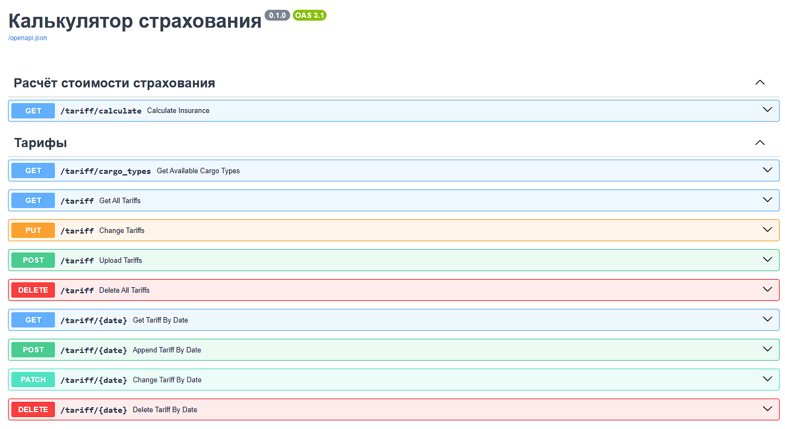

# Cервис по расчёту стоимости страхования в зависимости от типа груза и объявленной стоимости

### ТЗ: [click](assets/ТЗ.md)

## Описание

Этот проект представляет собой REST API для рассчёта страхования грузов и управления тарифами на страхование. Основные функции включают:

- Расчёт стоимости страхования.
- Загрузку и обновление тарифов.
- Удаление и получение тарифов.
- Обработку ошибок, интеграцию документации Swagger и ReDoc.

---

## Зависимости

### Python библиотеки (python 3.11):

- FastAPI - Web-фреймворк
- Sqlalchemy - ORM бля взаимодействия с БД
- Asyncpg - Асинхронный движок для PostgresSQL
- Alembic - Миграции
- Dishka - DI-фреймворк для управления инверсией зависимостями
- Pydantic-settings - Для легкого парсинга переменных окружения для конфигурации
- Faststream[aiokafka] - Для взааимодействия с Kafka (небольшой оверхед оказалось)
- Apscheduler - Для отправки логов раз в некоторое время

### База данных

- PostgreSQL

### Брокер сообщений

- Kafka

### Контейнеризация

- Docker
- docker compose

---

## Запуск приложения

### Настройка переменных окружения:

1. Переименуйте `.env.prod.example` в `.env.prod`
2. Переменные должны свопадать

- `POSTGRES_USER = DB_USER`
- `POSTGRES_PASSWORD = DB_PASSWORD`
- `POSTGRES_DB = DB_NAME`

3. Задайте свои переменные если хотите
4. Запускается всё в docker-compose. Для удобства сделан скрипт.

Linux:

```bash
chmod +x start.sh
./start.sh
```

Windows:

```
.\start.bat
```

После запуска перейдите по ссылке в браузере: http://127.0.0.1:8000

---

## Основные компоненты

### OpenAPI (Swagger) документация:



1. **Расчёт стоимости страхования**
   Маршрут `/tariff/calculate (GET)` принимает данные о типе груза, тарифе и дате, возвращая рассчитанную стоимость страхования.

2. **Работа с тарифами**
   Реализован набор эндпоинтов для CRUD операций с тарифами:

- Получение доступных типов груза: `/tariff/cargo_types (GET)`
- Загрузка тарифов: `/tariff (POST)`, `/tariff/{date} (POST)`
- Получение тарифов: `/tariff (GET)`, `/tariff/{date} (GET)`
- Обновление тарифов: `/tariff (PUT)`, `/tariff/{date} (PATCH)`
- Удаление тарифов: `/tariff (DELETE)`, `/tariff/{date} (DELETE)`

3. **Обработка ошибок**

   - `TariffNotFoundError` - Не найден тарифа на указанный тип груза.
   - `UploadTariffsWhenStorageNotEmptyError` - Попытка загрузить на одну дату несколько тарифов с одинаковым типом груза.

4. **Документация API**
   Swagger UI: http://127.0.0.1:8000/docs
   ReDoc: http://127.0.0.1:8000/redoc
5. **Примеры запросов**
   Экземпляры запросов и ответов предопределены и интегрированы в обработчики маршрутов.

---

## Структура проекта

Проект разработан с элементами Чистой архитектуры (Clean Architecture) для модульности и масштабируемости. Основные уровни:

1. **Domain**
   Сущности и их бизнес-логика. Этот слой изолирован от остальных.

2. **Application**
   Сценарии использования и сервисы для взаимодействия с бизнес логикой. Также включает интерфейсы для взаимодействия с данными.

3. **Infrastructure**
   Реализация взаимодействия с внешними системами:

- Persistence — работа с базой данных (PostgreSQL).
- Kafka Logger — отправка логов в Apache Kafka с использованием Transactional Outbox (запись в базу и периодическая отправка сообщений батчами).
- Dependency Injection (DI) — используется Dishka, обеспечивающий внедрение зависимостей.

4. **Presentation**
   Реализация REST API с помощью FastAPI: маршруты, валидация, обработка ошибок.

---

## TODO

- Пользователи
- Тесты
